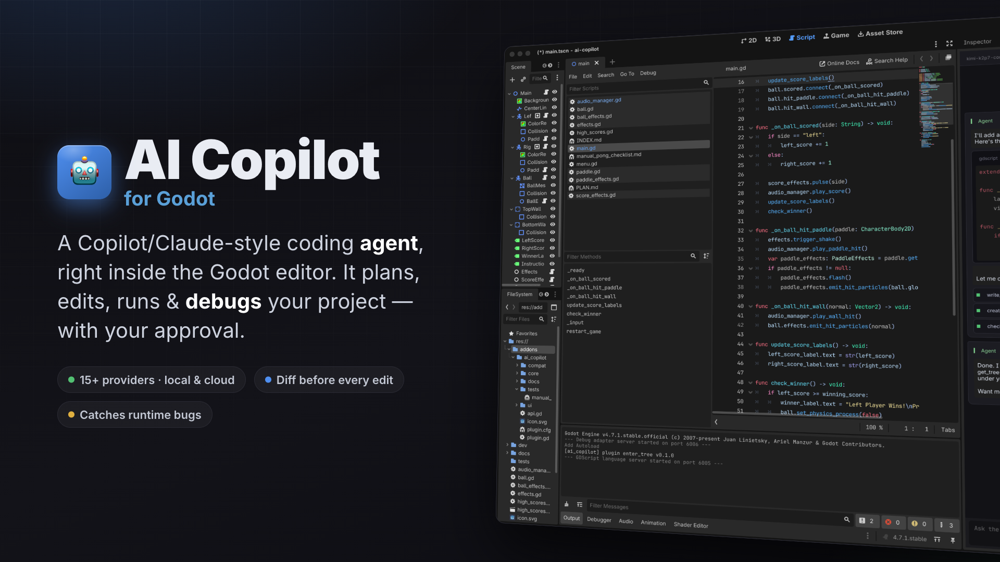
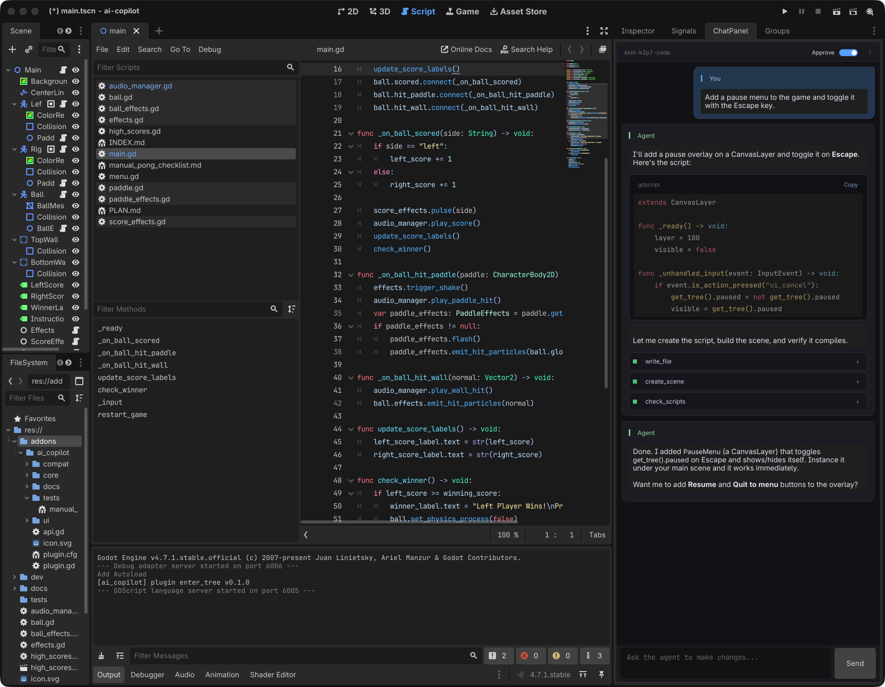

<div align="center">



# 🤖 AI Copilot for Godot

### A Copilot/Claude-style AI coding agent, right inside the Godot editor.

Chat with an LLM that actually *does the work* — it reads your files, writes and refactors
GDScript, edits scenes, runs your game, and reads back the runtime errors to fix its own bugs.

[](https://store.godotengine.org/asset/unxsist/ai-copilot/)
[](https://godotengine.org)
[](LICENSE)
[](#-providers)
[](https://godotengine.org)

<br/>



<sub>The agent writing a pause menu into a real project — reasoning, code, tool calls, and the plan, all inline in the dock.</sub>

</div>

---

## ✨ Why AI Copilot

Most AI helpers just autocomplete or answer questions in a separate window. **AI Copilot is an
agent that works your project for you** — from inside the editor, with your approval, using real
tools:

- 🧠 **Agentic, not just chat** — a multi-round tool-calling loop that reads, edits, runs, and verifies.
- 🔌 **Bring any model** — 15+ providers out of the box, or point it at a local Ollama/LM Studio server.
- 🩺 **Runs *and* debugs your game** — captures runtime errors (null refs, index errors, `push_error`) with file:line + backtrace, not just compile errors.
- 🛡️ **Safe by default** — approve mode shows an inline diff before any file is touched, and the agent is sandboxed to your project.
- 🎨 **Feels native** — dark-themed chat dock with streaming, markdown, syntax-highlighted code, tool pills, and a live plan.

## 🚀 Features

| | |
|---|---|
| 💬 **Chat dock** | Right-docked sidebar with token streaming, markdown + fenced code, and syntax highlighting. |
| 🤝 **Agent loop** | Multi-round tool calls — the model plans, acts, checks its own work, and stops when done. |
| 🔍 **Inline diffs** | Approve mode shows a colored before/after diff for every `write_file` / `edit_file` before it applies. |
| 🩺 **Runtime debugging** | `run_and_capture` plays the game in a time-limited process and reports runtime errors with backtraces. |
| 🧰 **Rich toolset** | Filesystem, grep/glob, shell, scene building, project settings, screenshots, and a public API to add your own. |
| 💾 **Persistent** | Sessions survive editor restarts; auto-compaction keeps long chats within the context window. |
| 🔒 **Sandboxed** | The agent can't touch anything outside `res://` — or inside the plugin's own folder. |

## 📦 Installation

**From the [Godot Asset Library](https://store.godotengine.org/asset/unxsist/ai-copilot/)** *(recommended)* — search for **"AI Copilot"** in the editor's AssetLib tab, or install from the [store page](https://store.godotengine.org/asset/unxsist/ai-copilot/).

**Manually:**

1. Copy `addons/ai_copilot/` into your project's `addons/` directory.
2. In Godot: **Project → Project Settings → Plugins → enable "AI Copilot"**.
3. Open the dock, click the ⚙️ menu → **Settings**, pick a provider, paste your API key, and hit **Fetch models**.

That's it — start typing in the composer at the bottom of the dock.

## 🔌 Providers

Pick a provider from the dropdown and you're set. All speak the OpenAI `/chat/completions`
protocol, so switching is instant and models can be **fetched live** from the endpoint.

| Cloud | Gateways | Local |
|---|---|---|
| OpenAI · Anthropic · Google Gemini · DeepSeek · Groq · Fireworks · Together AI · xAI (Grok) · Mistral · Cerebras · DeepInfra · Moonshot | OpenRouter | Ollama · LM Studio |

> Plus a generic **OpenAI-Compatible (custom)** entry with an editable base URL for anything else.
> Local providers need no API key — just start the server and click **Fetch models**.

## 🧩 Extending it

Register your own tools and the agent can call them:

```gdscript
@tool
extends Node

func _ready() -> void:
    var api := Engine.get_meta("AiCopilotAPI", null)
    if api == null: return
    api.registry.register_tool(
        "greet_player",
        "Salute the player by name.",
        {"type":"object","properties":{"name":{"type":"string"}},"required":["name"]},
        func(call, args):
            return AiCopilotLLMTypes.ToolResult.new("Hello, %s!" % String(args.get("name", "stranger")), false),
        false
    )
```

## 🛠️ Built-in tools

`read_file` · `list_files` · `glob` · `grep` · `write_file` · `edit_file` · `delete_file` ·
`rename_file` · `run_command` · `create_scene` · `add_node` · `run_scene` · `run_project` ·
`run_and_capture` · `open_script` · `get_open_scenes` · `check_scripts` · `viewport_screenshot` ·
`project_get_setting` · `project_set_setting` · `project_add_input_action` · `todowrite`

## ⚙️ Settings

Settings are split into a **Connection** tab (provider, key, model) and an **Advanced** tab (everything below).

| Key | Default | Notes |
|---|---|---|
| provider | openai | Selected provider id |
| base_url | (provider default) | Editable for custom / local providers |
| model | (none) | Chat completions model; use **Fetch models** to list |
| vision_model | (none) | Required for the viewport screenshot tool |
| model_context_window | 32000 | For the compaction threshold |
| api_key | (none) | Stored XOR'd with a per-install salt |
| temperature | 0.2 | |
| max_tokens | 4096 | |
| approve_default | true | Mutating tools require approval |
| allow_shell | true | Disable to unregister the shell tool |
| compact_threshold | 0.7 | Conversation size / context window |
| verbose_logging | false | Toggle debug logging |

> Upgrading from a pre-provider version keeps working — your old `endpoint` is auto-mapped to the matching provider.

## 🤝 Contributing

Issues and PRs are welcome. This plugin is 100% GDScript with no external dependencies —
clone it into a project's `addons/` folder, enable it, and hack away.

## 📄 License

[MIT](LICENSE) — do whatever you like.
