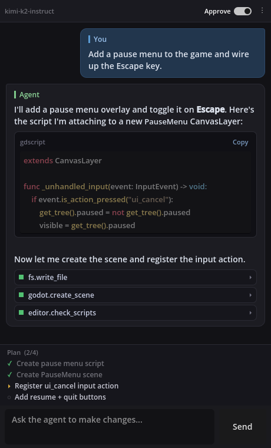
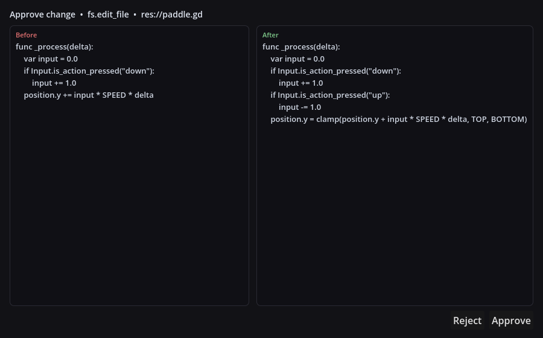
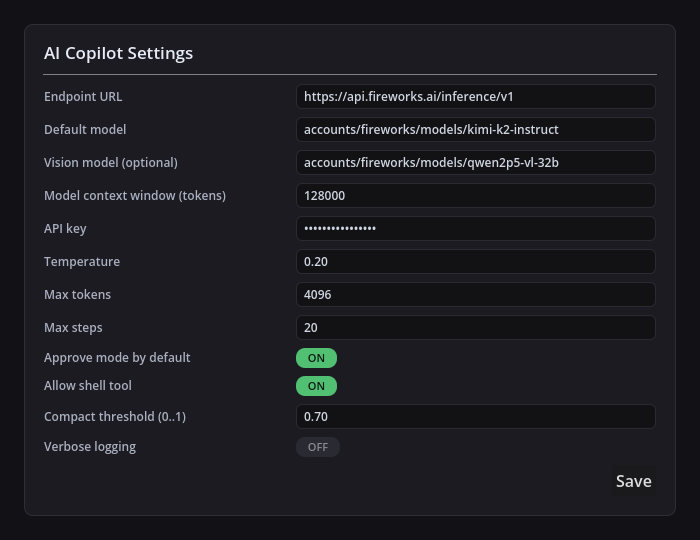

# AI Copilot — Godot Editor Plugin

A Copilot/Claude-style chat sidebar embedded in the Godot 4.7 editor. Chat with an LLM
that can edit your project: read files, write scripts, refactor scenes, run shell commands,
and inspect the live editor state.

## Features

- Chat sidebar (right-dock), markdown + fenced-code rendering with syntax highlighting.
- Streaming token-by-token (with graceful fallback to batch).
- Agent loop with tool calls (multi-round, max 20 steps per message).
- Approve mode (default) shows side-by-side diffs for `fs.write_file` / `fs.edit_file`.
- Tools: `fs.read_file`, `fs.list_files`, `fs.write_file`, `fs.edit_file`, `fs.delete_file`, `fs.rename`, `fs.grep`, `shell.run`, `editor.get_open_scenes`, `editor.open_script`, `editor.viewport_screenshot`.
- Sandbox: agent cannot access outside `res://` or inside `res://addons/ai_copilot/`.
- Session persistence across editor restarts.
- Auto-compaction when conversation approaches the model context window.
- Public tool registration API.

## Screenshots

| Chat sidebar | Diff approval | Settings |
|---|---|---|
|  |  |  |

## Installation

1. Copy `addons/ai_copilot/` into your project's `addons/` directory.
2. In Godot: **Project → Project Settings → Plugins → enable "AI Copilot"**.
3. Click the gear in the dock; set your Fireworks API key and model.

## Adding your own tools

```gdscript
@tool
extends Node

func _ready() -> void:
    var api := Engine.get_meta("AiCopilotAPI", null)
    if api == null: return
    api.registry.register_tool(
        "project.greet_player",
        "Salute the player by name.",
        {"type":"object","properties":{"name":{"type":"string"}},"required":["name"]},
        func(call, args):
            return AiCopilotLLMTypes.ToolResult.new("Hello, %s!" % String(args.get("name", "stranger")), false),
        false
    )
```

## Settings

| Key | Default | Notes |
|---|---|---|
| endpoint | https://api.fireworks.ai/inference/v1 | OpenAI-compatible endpoint |
| model | (none) | Chat completions model |
| vision_model | (none) | Required for viewport screenshot |
| model_context_window | 32000 | For compaction threshold |
| api_key | (none) | Stored XOR'd with per-install salt |
| temperature | 0.2 | |
| max_tokens | 4096 | |
| max_steps | 20 | Tool call limit per message |
| approve_default | true | Mutating tools need approval |
| allow_shell | true | Disable to unregister shell.run |
| compact_threshold | 0.7 | Conversation / context window |
| verbose_logging | false | Toggle debug logging |

## License

MIT
